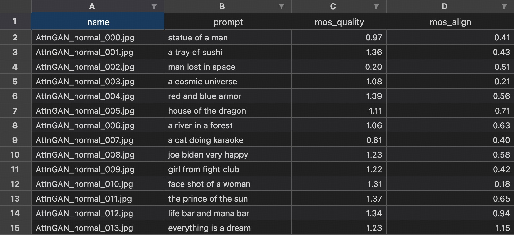

# IP-IQA
[ICME2024, Official Code] for paper ["Bringing Textual Prompt to AI-Generated Image Quality Assessment"](https://arxiv.org/abs/2403.18714).

[View the Poster](assets/poster.pdf)


## Installation
You can use `conda` to configure the virtual environment with only three lines of commands. As following:
```bash
conda create -n ipiqa python=3.9
conda activate ipiqa
pip install -e .
```

## Weights & Data

### CLIP ResNet50 weights
Download Link: [RN50.pt](https://openaipublic.azureedge.net/clip/models/afeb0e10f9e5a86da6080e35cf09123aca3b358a0c3e3b6c78a7b63bc04b6762/RN50.pt)

After that, you can place it to `cache/ckpt/clip/openai/resnet/RN50.pt` or modify the `base_ckpt` in yaml file like [ipiqa.yaml](https://github.com/Coobiw/IP-IQA/blob/master/ipiqa/projects/agiqa3k/ipiqa.yaml#L3).

### AGIQA-1k Database
Please get the data refer to its [Official Repo](https://github.com/lcysyzxdxc/AGIQA-1k-Database).

After that, please set your path in [dataset path and images root](https://github.com/Coobiw/IP-IQA/blob/master/ipiqa/projects/agiqa1k/ipiqa.yaml#L13) of the yaml file.

### AGIQA-3k Database
Please get the data refer to its [Official Repo](https://github.com/lcysyzxdxc/AGIQA-3k-Database).

After that, please set your path in [dataset path and images root](https://github.com/Coobiw/IP-IQA/blob/master/ipiqa/projects/agiqa3k/ipiqa.yaml#L13) of the yaml file.

Additionally, you need to get a `mos_joint.xlsx` file, which is organized like following:



### Data Organization for Reference
```bash
├── cache
│   |── data
│   |   ├── aigc_qa_3k # AGIQA-3k
│   │   │   ├── AGIQA-3k # the vis_root
│   │   │   |   ├── xxx.jpg
│   │   │   ├── mos_joint.xlsx
│   │   │   ├── data.csv
│   │   │   |
│   │   │   ├── aigc_QA_data1 # AGIQA-1k
│   │   │   |   ├── AGIQA-1k-Database-main # git clone their repo
│   │   │   |   ├── images # the vis_root
```

## Train & K-folds Evaluation

### AGIQA-1k
run:
```bash
python train_agiqa1k.py --cfg-path ipiqa/projects/agiqa1k/ipiqa.yaml --num_cv 10
```

DDP:
```bash
python -m torch.distributed.run --nproc_per_node 2 train_agiqa1k.py --cfg-path ipiqa/projects/agiqa1k/ipiqa.yaml --num_cv 10
```

### AGIQA-3k
run:
```bash
python train_agiqa3k.py --cfg-path ipiqa/projects/agiqa3k/ipiqa.yaml --num_cv 10
```

DDP:
```bash
python -m torch.distributed.run --nproc_per_node 2 train_agiqa3k.py --cfg-path ipiqa/projects/agiqa3k/ipiqa.yaml --num_cv 10
```

## Acknowledgement

- [MPP-Qwen](https://github.com/Coobiw/MiniGPT4Qwen): My personal MLLM Project. The `trainer` and prototype of this repo is a reference to it.
- [LAVIS](https://github.com/salesforce/LAVIS): An excellent repo for multimodal learning. Refer to its `Trainer` implementation.
- [AGIQA-1k](https://github.com/lcysyzxdxc/AGIQA-1k-Database) and [AGIQA-3k](https://github.com/lcysyzxdxc/AGIQA-3k-Database): Thanks to their database!
- [OpenAI-CLIP](https://github.com/openai/CLIP): Use their pretrained weights.

## Citation
```
@misc{qu2024bringingtextualpromptaigenerated,
      title={Bringing Textual Prompt to AI-Generated Image Quality Assessment}, 
      author={Bowen Qu and Haohui Li and Wei Gao},
      year={2024},
      eprint={2403.18714},
      archivePrefix={arXiv},
      primaryClass={cs.CV},
      url={https://arxiv.org/abs/2403.18714}, 
}
```